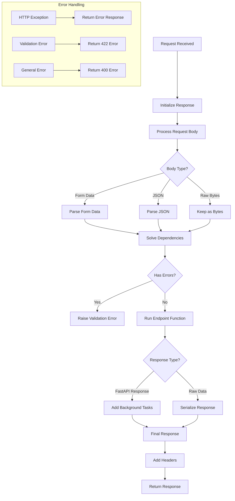

# FastAPI & Psycopg

## FastAPI runtime



## FastAPI's Depends system:
`Depends` is FastAPI's dependency injection system. It's a way to:
1. Share code between endpoints
2. Handle authentication
3. Get database connections
4. Manage state and resources

```py
# In app/db/database.py
async def db_conn(request: Request) -> AsyncGenerator[Connection, None]:
    db_pool = cast(AsyncConnectionPool, request.state.db_pool)
    async with db_pool.connection() as conn:
        yield conn

# In app/users/user_routers.py
@router.get("")
async def get_users(
    db: Annotated[Connection, Depends(db_conn)],  # Uses the dependency
    _: Annotated[DbUser, Depends(super_admin)],   # Another dependency
    page: int = Query(1, ge=1),
    results_per_page: int = Query(13, le=100),
    search: str = "",
):
```

Key points about Depends:
1. Reusability: The same dependency can be used across multiple endpoints
2. Caching: By default, FastAPI caches the result of dependencies for the same request
3. Nesting: Dependencies can depend on other dependencies
4. Resource Management: Great for managing database connections, file handles, etc.
