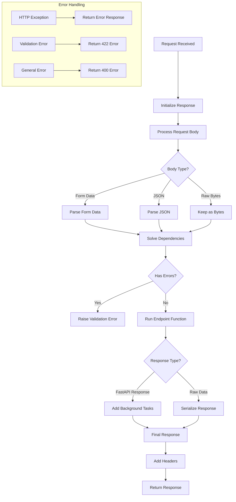

# FastAPI & Psycopg

## FastAPI requests handling process.



## FastAPI's Depends system:
`Depends` is FastAPI's dependency injection system. It's a way to:
1. Share code between endpoints
2. Handle authentication
3. Get database connections
4. Manage state and resources

```py
# In app/db/database.py
async def db_conn(request: Request) -> AsyncGenerator[Connection, None]:
    db_pool = cast(AsyncConnectionPool, request.state.db_pool)
    async with db_pool.connection() as conn:
        yield conn

# In app/users/user_routers.py
@router.get("")
async def get_users(
    db: Annotated[Connection, Depends(db_conn)],  # Uses the dependency
    _: Annotated[DbUser, Depends(super_admin)],   # Another dependency
    page: int = Query(1, ge=1),
    results_per_page: int = Query(13, le=100),
    search: str = "",
):
```

Key points about Depends:
1. Reusability: The same dependency can be used across multiple endpoints
2. Caching: By default, FastAPI caches the result of dependencies for the same request
3. Nesting: Dependencies can depend on other dependencies
4. Resource Management: Great for managing database connections, file handles, etc.


### FastAPI Lifespan
- FastAPI 应用生命周期管理
- 启动和关闭事件处理
- 资源管理示例:
  ```python
  from contextlib import asynccontextmanager
  
  @asynccontextmanager
  async def lifespan(app: FastAPI):
      # 启动时执行
      await startup()
      yield
      # 关闭时执行
      await shutdown()
  ```

## psycopg
- 异步数据库连接
- 连接池管理
- SQL 查询执行

### async connection pool
- 使用 asyncpg 创建连接池
- 连接池配置和管理
- 示例:
  ```python
  from asyncpg import create_pool
  
  pool = await create_pool(
      user='user',
      password='password',
      database='dbname',
      host='localhost',
      min_size=5,      # 池中最小连接数
      max_size=20,     # 池中最大连接数
      timeout=30.0     # 获取连接的超时时间
  )
  ```

### Raw factories with Pydantic
在使用原始 SQL 查询时，我们常需要将查询结果转换为 Pydantic 模型。以下是详细的实现方式：

#### 1. 基础模型定义
```python
from datetime import datetime
from pydantic import BaseModel
from typing import Optional

class UserBase(BaseModel):
    id: int
    username: str
    email: str
    created_at: datetime
    updated_at: Optional[datetime] = None
```

#### 2. 工厂模式实现
```python
from typing import List, Dict, Any
import asyncpg

class UserFactory:
    @staticmethod
    def from_row(row: asyncpg.Record) -> UserBase:
        # 将数据库行转换为字典
        data = dict(row)
        # 创建 Pydantic 模型实例
        return UserBase(**data)
    
    @staticmethod
    def from_rows(rows: List[asyncpg.Record]) -> List[UserBase]:
        # 批量转换多行数据
        return [UserFactory.from_row(row) for row in rows]

class DatabaseManager:
    def __init__(self, pool: asyncpg.Pool):
        self.pool = pool
    
    async def fetch_users(self) -> List[UserBase]:
        async with self.pool.acquire() as conn:
            # 执行原始 SQL 查询
            rows = await conn.fetch("""
                SELECT id, username, email, created_at, updated_at
                FROM users
                WHERE is_active = true
            """)
            # 使用工厂方法转换结果
            return UserFactory.from_rows(rows)

    async def execute_with_fallback(self, query: str):
        try:
            async with self.pool.acquire() as conn:
                return await conn.fetch(query)
        except asyncpg.exceptions.PoolTimeout:
            # 可以实现降级策略
            # 1. 返回缓存数据
            # 2. 使用备用数据库
            # 3. 返回部分数据
            pass
```

### Database Connection Pool Management with Timeout handling and Retry Mechanism

```
from asyncpg.pool import Pool
from typing import Optional, List
import asyncio

class DatabasePool:
    def __init__(
        self,
        pool: Pool,
        timeout: float = 30.0,
        max_retries: int = 3
    ):
        self.pool = pool
        self.timeout = timeout
        self.max_retries = max_retries
    
    async def execute_with_retry(
        self,
        query: str,
        *args,
        retry_count: int = 0
    ) -> Optional[List[Record]]:
        try:
            async with self.pool.acquire(timeout=self.timeout) as conn:
                return await conn.fetch(query, *args)
        except asyncpg.exceptions.PoolTimeout:
            if retry_count < self.max_retries:
                # 指数退避重试
                await asyncio.sleep(2 ** retry_count)
                return await self.execute_with_retry(
                    query,
                    *args,
                    retry_count=retry_count + 1
                )
            raise  # 重试耗尽后抛出异常

async def robust_database_operation():
    try:
        async with pool.acquire() as conn:
            result = await conn.fetch("SELECT * FROM users")
            return result
    except asyncpg.exceptions.PoolTimeout:
        # 处理连接池超时
        log.warning("Connection pool timeout")
        return await fallback_operation()
    except asyncpg.exceptions.PostgresError:
        # 处理数据库错误
        log.error("Database error")
        raise
```